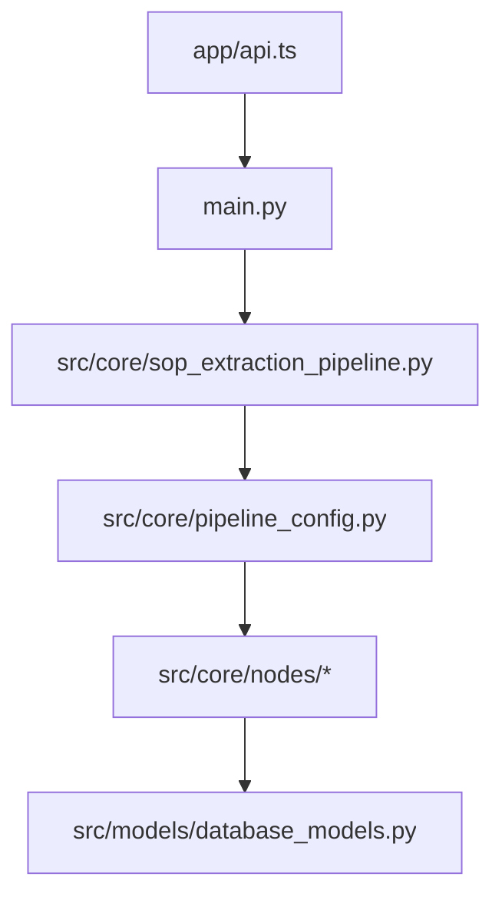

# 核心目标 / Core Objective

构建 `CODEBASE.md` 作为**活体本体（Living Ontology）**，并强制满足：
- **完整性**：所有源文件必须覆盖
- **细节性**：函数签名、核心逻辑、数据流、副作用
- **可追踪性**：每次阅读都有目的、结论、立即更新记录
- **持续增量**：禁止“读完再写”

---

# 第一原则（新增，最高优先级）

## P0 — 微循环强制执行（Mandatory Micro-Loop）

每一次阅读（哪怕只读了一个文件的一部分）后，必须立刻更新 `CODEBASE.md`：

```
读取一个目标（文件/片段）
  -> 记录本次阅读目的（为什么读）
  -> 提炼结论（确认/推断/冲突）
  -> 立即写入 CODEBASE.md 对应章节
  -> 更新 Coverage 表
  -> 写入 Iteration Log
  -> 再选择下一个目标
```

**禁止行为：**
- 批量读完多个文件后一次性回填
- 两阶段（先阅读、后统一输出）
- 覆盖表不实时更新

只要发生阅读，就必须发生一次对应更新。

---

# 强制规则 / Strict Rules

## 规则 1 — 禁止批处理阅读

❌ 错误：先扫全仓库，再统一写本体  
✅ 正确：读 1 个目标 -> 立刻更新 -> 再读下 1 个目标

## 规则 2 — 每次阅读必须有“目的”

每次阅读前都要明确：
- 本轮目标问题是什么？
- 为什么读这个文件/片段？
- 预期补齐哪个本体空白？

## 规则 3 — 每次更新必须可追溯

每轮更新都必须写 `Iteration Log`，至少包含：
- 轮次编号
- 阅读目标
- 阅读目的
- 新结论
- 修订章节
- 下一轮计划

## 规则 4 — 全量覆盖不可跳过

覆盖表中所有文件必须最终为已读。允许深度分层，但禁止未读文件。

## 规则 5 — 置信度标注

每条关键结论必须带标签：
- `(verified)` 代码直接可见
- `(inferred)` 基于调用关系推断
- `(partial)` 尚未闭环
- `(conflict)` 存在矛盾待解

## 规则 6 — 新证据即时修订

新证据与旧结论冲突时，必须当轮修订，不允许“后面再说”。

---

# 产出结构（强制）

`CODEBASE.md` 最终必须包含以下章节：

1. **Scope & Context**
2. **Coverage Report**（全量文件）
3. **Iteration Log**（逐轮增量更新轨迹）
4. **System Architecture**
5. **End-to-End Data Flows**（至少：任务创建->处理->持久化->前端展示）
6. **Frontend Processing Flow**（页面状态、数据获取、渲染路径）
7. **Backend Processing Flow**（API->服务->存储->异步流程）
8. **Frontend-Backend Interaction Matrix**（端点、调用方、请求/响应、副作用）
9. **File Dependency & Interaction Graph**（模块图+关键文件交互图，建议 mermaid）
10. **Per-File Ontology Index**
    - 文件职责
    - 对内/对外依赖
    - 顶层函数/类签名
    - 核心实现思路（简述）
11. **Risk / Conflict Register**
12. **Change Log**

---

# 覆盖与深度模型

## Coverage Report 模板

| 文件路径 | 首次阅读轮次 | 阅读次数 | 当前深度 | 当前目的 | 遗留问题 |
|---|---:|---:|---|---|---|
| src/main.py | 1 | 3 | 深度完整 | API主入口梳理 | 无 |
| ... | ... | ... | ... | ... | ... |

深度状态：
- `PENDING`
- `浅读`（职责级）
- `(partial)`（函数级未闭环）
- `(conflict)`（有矛盾）
- `深度完整`（函数级+数据流已闭环）

---

# 函数级捕获要求（强制）

对每个非平凡函数（>3行），至少记录：
- 签名：函数名、参数、返回
- 主要分支与控制路径
- 读取/写入的数据对象
- 外部副作用（DB、文件、网络、缓存、线程）
- 被谁调用 / 调用了谁（可推断）

---

# 文件交互图要求（新增强制）

必须输出至少两类图：

1. **模块级交互图**（frontend/backend/pipeline/storage/tools）
2. **关键文件交互图**（例如：`main.py -> pipeline_config.py -> nodes/* -> models`）

可用 mermaid，例如：



---

# 执行节拍（必须遵守）

每轮固定 6 步：
1. 选目标（带目的）
2. 阅读（文件或片段）
3. 提炼结论
4. 即时更新 `CODEBASE.md`
5. 更新覆盖表
6. 规划下一轮

**注意：第4步不能省略，也不能推迟。**

---

# 质量门禁（完成前检查）

发布前必须同时满足：
- [ ] Coverage 表无 `PENDING`
- [ ] Iteration Log 连续且与覆盖更新一致
- [ ] 有完整前后端交互矩阵
- [ ] 有全链路数据流
- [ ] 有文件交互图
- [ ] 有逐文件函数签名索引
- [ ] 所有关键结论都有置信度标签

任一不满足，任务不得宣告完成。

---

# 失败模式与纠正

若出现以下行为，必须立即纠正并回补：
- 批量阅读后统一更新
- 只做摘要不做函数级信息
- 没有图或没有交互矩阵
- 覆盖表和实际阅读不一致

纠正动作：
1. 在 Iteration Log 写明偏差
2. 立即回补缺失章节
3. 更新覆盖状态与结论标签

---

# 极简示例（正确节奏）

- 第12轮：读 `src/core/nodes/import_json_to_db_node.py`（目的：确认版本切换逻辑）
- 当轮更新：
  - Backend Processing Flow：补“active版本切换”
  - Per-File Ontology：补函数签名与副作用
  - Coverage：阅读次数+1，深度由`浅读`升到`深度完整`
  - Iteration Log：记录结论与下一轮计划

这就是正确行为：**每轮都有写入，不允许只读不写。**


## Reference Files

- `references/CODEBASE_TEMPLATE.md` — canonical template for writing/updating `CODEBASE.md`

